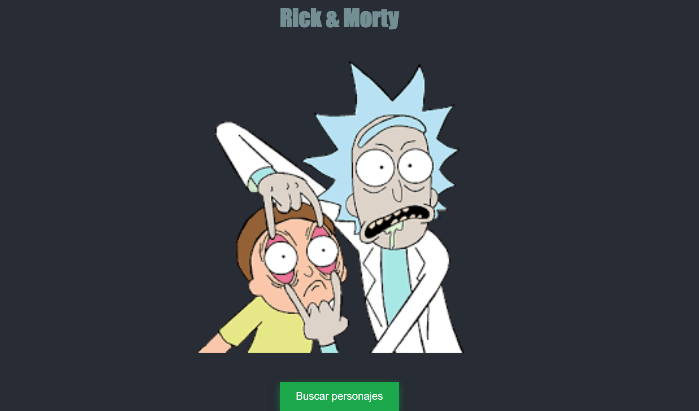
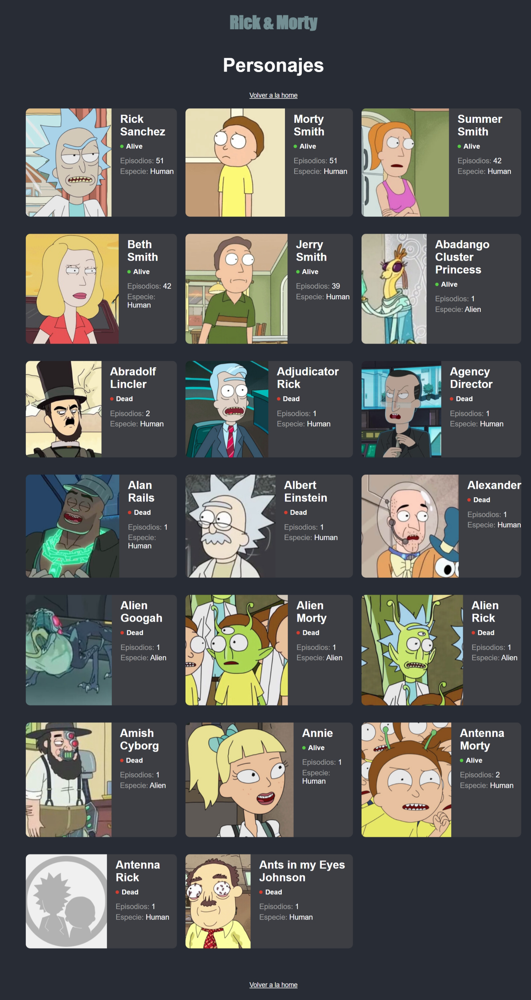

# Rick and Morty Course

[])
[]

## Link of page
-[Link]_(https://glistening-smakager-931c3c.netlify.app/)

## Table of Contents

- [Description](#description)
- [Installation](#installation)
- [Usage](#usage)
- [Contributing](#contributing)
- [Authors](#authors)
- [License](#license)

## Description

Rick and Morty Course is a web application that provides a comprehensive guide and resources for fans of the popular TV show "Rick and Morty". Whether you're a seasoned fan or just starting out, this course covers everything from character profiles to episode summaries and more.

## Installation

To run this project locally, follow these steps:

1. Clone the repository:

   ```bash
   git clone https://github.com/lcastillo24/rick-morthy-course.git
   
1. Open the index.html file in your web browser.
Usage
Browse through character profiles to learn more about your favorite characters.
Read episode summaries and explore detailed information about each episode.
Use the search functionality to quickly find specific characters or episodes.
Contributing
If you would like to contribute to this project, you can follow these steps:

Fork the repository.
Create a new branch (git checkout -b feature/new-feature).
Make your changes.
Commit your changes (git commit -am 'Add new feature').
Push to the branch (git push origin feature/new-feature).
Create a new Pull Request.
Authors
Laura Castillo - GitHub
License
This project is licensed under the MIT License - see the LICENSE file for details.


